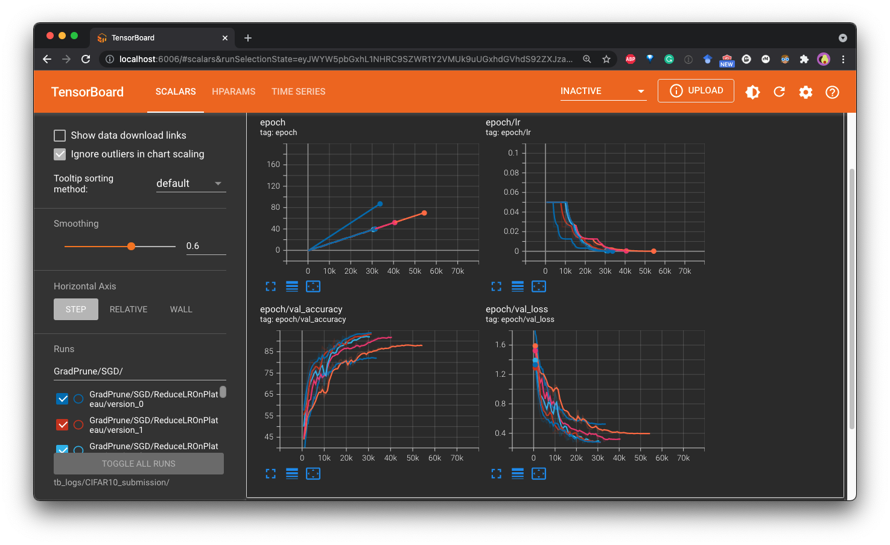
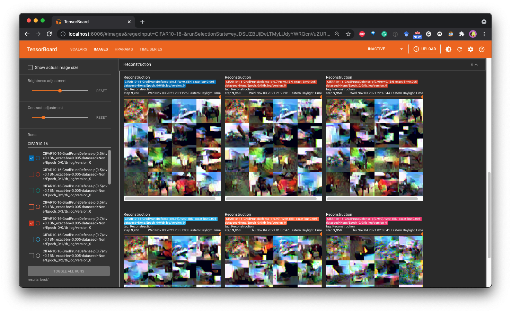

[](https://github.com/Princeton-SysML/GradAttack/actions/workflows/python-test.yml)

GradAttack is a Python library for easy evaluation of privacy risks in public gradients in Federated Learning, as well as corresponding mitigation strategies. The current version focuses on the gradient inversion attack in the image classification task, which recovers *private* images from *public* gradients. 


## Motivation

Recent research shows that sending gradients instead of data in Federated Learning can leak private information  (see [this growing list of attack paper](papers/gradient_inversion.md#papers-for-attacks)). These attacks demonstrate that an adversary eavesdropping on a client’s communications (i.e. observing the global modelweights and client update) can accurately reconstruct a client’s private data using a class of techniques known as “gradient inversion attacks", which raise serious concerns about such privacy leakage.


To counter these attacks, researchers have proposed defense mechanisms (see [this growing list of defense paper](papers/gradient_inversion.md#papers-for-defenses)). We are developing this framework to evaluate different defense mechanisms against state-of-the-art attacks. 


## Why GradAttack?

There are lots of reasons to use GradAttack:

- :smiling_imp:&nbsp; **Evaluate the privacy risk of your Federated Learning pipeline** by running on it various attacks supported by GradAttack 

- :pill:&nbsp; **Enhance the privacy of your Federated Learning pipeline** by applying defenses supported by GradAttack in a plug-and-play fashion

- :wrench:&nbsp; **Research and develop new gradient attacks and defenses** by reusing the simple and extensible APIs in GradAttack

### Slack Channel

For help and realtime updates related to GradAttack, please join [the GradAttack Slack](https://join.slack.com/t/gradattack/shared_invite/zt-yrbi6lf9-VRrzQcJUeGf185xDr4J~4A)!


## Installation

You may install GradAttack directly from PyPi using `pip`:

```
pip install gradattack
```

You can also install directly from the source for the latest features:
```
git clone https://github.com/Princeton-SysML/GradAttack
cd GradAttack
pip install -e .
```

## Getting started

To evaluate your model's privacy leakage against the gradient inversion attack, all you need to do is to:

1. Define your deep learning pipeline
```python
datamodule = CIFAR10DataModule()
model = create_lightning_module(
        'ResNet18',
        training_loss_metric=loss,
        **hparams,
    )
trainer = pl.Trainer(
        gpus=devices,
        check_val_every_n_epoch=1,
        logger=logger,
        max_epochs=args.n_epoch,
        callbacks=[early_stop_callback],
    )
pipeline = TrainingPipeline(model, datamodule, trainer)
```
2. (Optional) Apply defenses to the pipeline
```python
defense_pack = DefensePack(args, logger)
defense_pack.apply_defense(pipeline)
```
3. Run training with the pipeline (see detailed example scripts and bashes in [examples](examples/bashes/train_cifar10_bashes.md))
```
pipeline.run()
pipeline.test()
```

You may use the tensorboard logs to track your training and to compare results of different runs:
```
tensorboard --logdir PATH_TO_TRAIN_LOGS
```


4. Run attack on the pipeline (see detailed example scripts and bashes in [examples](examples/bashes/attack_cifar10_bashes.md))
```python
# Fetch a victim batch and define an attack instance
example_batch = pipeline.get_datamodule_batch()
batch_gradients, step_results = pipeline.model.get_batch_gradients(
        example_batch, 0)
batch_inputs_transform, batch_targets_transform = step_results[
    "transformed_batch"]
attack_instance = GradientReconstructor(
    pipeline,
    ground_truth_inputs=batch_inputs_transform,
    ground_truth_gradients=batch_gradients,
    ground_truth_labels=batch_targets_transform,
)

# Define the attack instance and launch the attack
attack_trainer = pl.Trainer(
    max_epochs=10000,
)
attack_trainer.fit(attack_instance,)
```

You may use the tensorboard logs to track your attack and to compare results of different runs:
```
tensorboard --logdir PATH_TO_ATTACK_LOGS
```


5. Evalute the attack results (see [examples](examples/bashes/calc_metric_bashes.md))
```shell
python examples/calc_metric.py --dir PATH_TO_ATTACK_RESULTS
```

## Contributing to GradAttack

GradAttack is currently in an "alpha" stage in which we are working to improve its capabilities and design.

Contributions are welcome! See [the contributing guide](CONTRIBUTE.md) for detailed instructions on how to contribute to our project.

## Citing GradAttack

If you want to use GradAttack for your research (much appreciated!), you can cite it as follows:

```bibtex
@inproceedings{huang2021evaluating,
  title={Evaluating Gradient Inversion Attacks and Defenses in Federated Learning},
  author={Huang, Yangsibo and Gupta, Samyak and Song, Zhao and Li, Kai and Arora, Sanjeev},
  booktitle={NeurIPS},
  year={2021}
}
```

## Acknowledgement

This project is supported in part by Ma Huateng Foundation, Schmidt Foundation, NSF, Simons Foundation, ONR and DARPA/SRC. Yangsibo Huang and Samyak Gupta are supported in part by the Princeton Graduate Fellowship.
We would like to thank Quanzheng Li, Xiaoxiao Li, Hongxu Yin and Aoxiao Zhong for helpful discussions, and members of Kai Li’s and Sanjeev Arora’s research groups for comments on early versions of this library.
